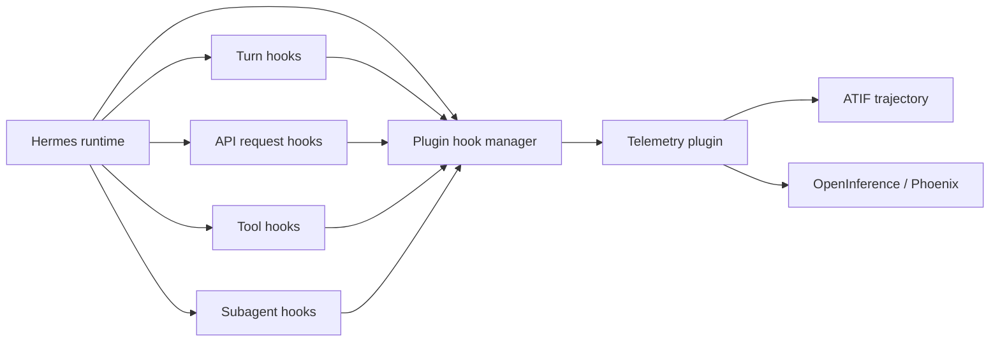
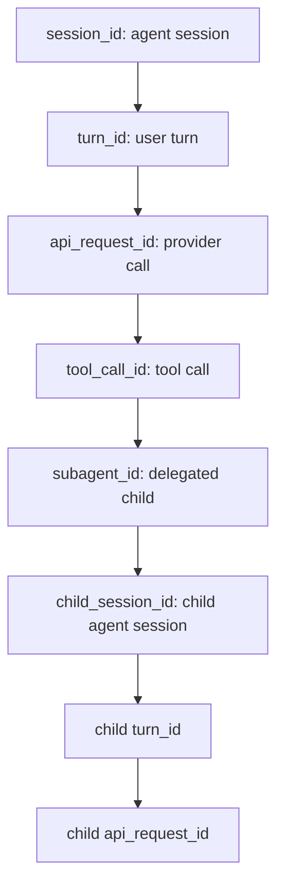
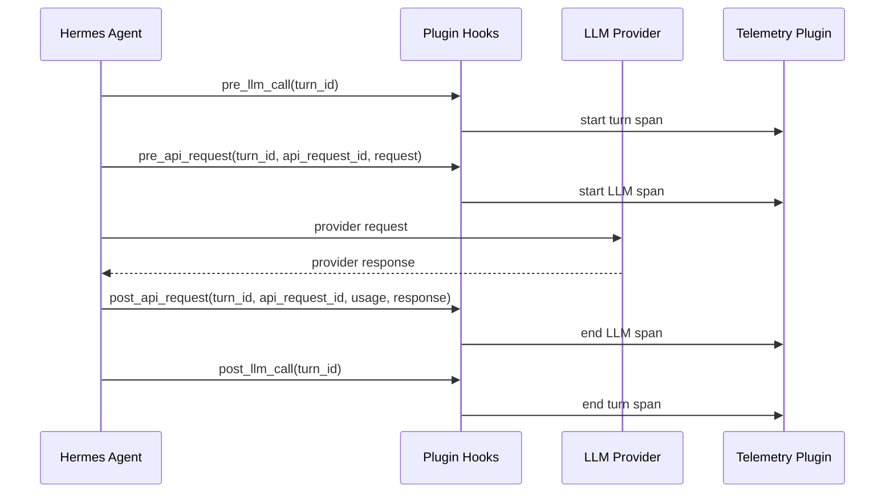
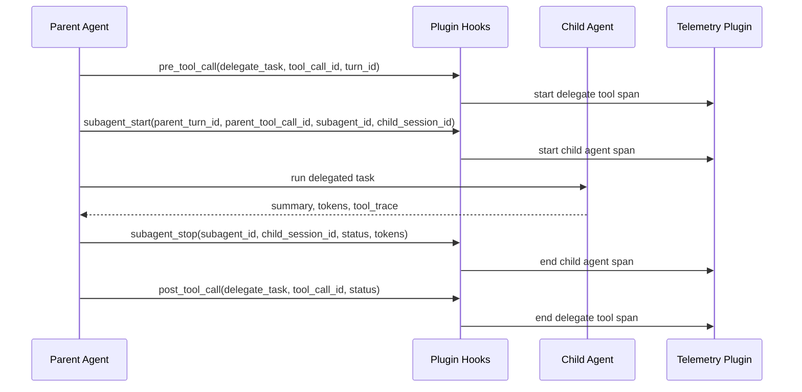

# Add observer-grade middleware fields for full-fidelity agent observability

## Summary

Hermes now has a strong plugin middleware foundation for native telemetry, but
it is still missing the fields needed for full-fidelity agent observability
without routing LLM traffic through a sidecar/gateway.

Validated against Hermes `origin/main` at:

```text
7e2af0c2e feat(acp): pass image file attachments through as image_url parts
```

Current Hermes can now observe:

- session lifecycle
- per-turn LLM lifecycle
- request-scoped API summaries
- provider token usage
- tool calls and tool latency
- subagent completion
- gateway pre-dispatch
- approval request/response lifecycle
- final LLM and tool-result transform hooks

The remaining gaps are more specific: stable cross-hook correlation IDs, full
sanitized API request/response payloads, API failure/retry hooks, subagent start
events, and richer structured status/error metadata.

## Target Architecture

The desired end state is first-party Hermes middleware that lets an observer
plugin emit complete traces without monkey-patching Hermes internals and without
routing traffic through a sidecar gateway.



## Current Code Evidence

Paths below refer to the Hermes source tree.

### Existing valid hooks

`hermes_cli/plugins.py:78-118` now includes:

```python
VALID_HOOKS = {
    "pre_tool_call",
    "post_tool_call",
    "transform_terminal_output",
    "transform_tool_result",
    "transform_llm_output",
    "pre_llm_call",
    "post_llm_call",
    "pre_api_request",
    "post_api_request",
    "on_session_start",
    "on_session_end",
    "on_session_finalize",
    "on_session_reset",
    "subagent_stop",
    "pre_gateway_dispatch",
    "pre_approval_request",
    "post_approval_response",
}
```

So the request is not for a broad plugin system. That exists. The ask is for
the additional observer-grade payload fields needed to build complete traces.

### Turn hooks are useful but not correlated

`run_agent.py:11062-11086` emits `pre_llm_call` once per turn with:

- `session_id`
- `user_message`
- `conversation_history`
- `is_first_turn`
- `model`
- `platform`
- `sender_id`

`run_agent.py:14282-14297` emits `post_llm_call` once after the tool-calling
loop succeeds.

These hooks do not expose a stable `turn_id`. A telemetry plugin therefore has
to infer which API requests and tool calls belong to a turn from ordering and
session-local counters.

### API hooks expose summaries, not full request/response payloads

`run_agent.py:11530-11553` builds `api_kwargs`, then emits
`pre_api_request`. The hook payload contains summary metadata:

- `task_id`
- `session_id`
- `platform`
- `model`
- `provider`
- `base_url`
- `api_mode`
- `api_call_count`
- `message_count`
- `tool_count`
- `approx_input_tokens`
- `request_char_count`
- `max_tokens`

It does not include the sanitized request payload itself: messages, tools,
tool choice, generation config, stream settings, image parts, or
provider-specific request shape.

`run_agent.py:13338-13359` emits `post_api_request` with:

- `task_id`
- `session_id`
- `platform`
- `model`
- `provider`
- `base_url`
- `api_mode`
- `api_call_count`
- `api_duration`
- `finish_reason`
- `message_count`
- `response_model`
- `usage`
- `assistant_content_chars`
- `assistant_tool_call_count`

`run_agent.py:4409-4422` explicitly summarizes usage and drops raw usage. The
hook also does not expose the full sanitized provider response, assistant
content, reasoning, or assistant tool-call declarations.

The current tests encode this limitation:

- `tests/run_agent/test_run_agent.py:2491-2492` asserts `"messages" not in`
  `pre_api_request` and `"response" not in` `post_api_request`.
- `tests/run_agent/test_provider_parity.py:430` asserts `"messages" not in`
  provider kwargs.

### Tool hooks now include duration, but not structured status

`model_tools.py:773-784` emits `post_tool_call` with `duration_ms`, which is
useful and should be preserved.

The remaining tool gap is structured outcome metadata. Today, plugins receive
the result string and must infer status/error by parsing it. Production traces
would benefit from explicit fields:

- `status`: `ok`, `error`, `blocked`, `cancelled`
- `error_type`
- `error_message`
- `started_at`
- `ended_at`
- `turn_id`
- `api_request_id` when known

### Subagent completion exists, but subagent start and correlation are missing

`tools/delegate_tool.py:2182-2217` now emits `subagent_stop` once per child
with:

- `parent_session_id`
- `child_role`
- `child_summary`
- `child_status`
- `duration_ms`

This is useful, but it is completion-only. There is still no
`subagent_start`, and `subagent_stop` does not expose enough IDs to build a
full nested scope:

- child session id
- stable subagent id
- parent turn id
- parent tool call id
- task index
- model/provider/toolsets
- token totals
- API call count
- tool trace
- exit reason

Much of this data already exists in `tools/delegate_tool.py:1663-1683`, where
the child result is assembled.

### Gateway and approval hooks are now addressed

The earlier gap around gateway ingress is addressed:

- `pre_gateway_dispatch` exists in `VALID_HOOKS`.
- `gateway/run.py:4893-4908` emits it before auth/pairing/dispatch.

The earlier approval lifecycle gap is also addressed:

- `pre_approval_request` and `post_approval_response` exist in `VALID_HOOKS`.
- `tools/approval.py:1071-1082` emits gateway `pre_approval_request`.
- `tools/approval.py:1156-1165` emits gateway `post_approval_response`.
- `tools/approval.py:1211-1231` emits CLI approval request/response hooks.

These no longer need to be part of the upstream ask, except for optional
correlation IDs such as `turn_id` and `tool_call_id`.

### Session boundary hooks exist, but payloads are minimal

`on_session_finalize` and `on_session_reset` exist and are emitted by CLI and
gateway paths. For telemetry, their semantics are useful, but their payloads
are still minimal.

Suggested additions:

- `reason`: `cli_exit`, `gateway_stop`, `session_expired`, `reset`,
  `new_session`, `timeout`, `interrupt`
- `old_session_id` / `new_session_id` for reset flows
- `completed`
- `interrupted`

## Remaining Middleware Additions Needed

### 1. Stable correlation identifiers

Add stable IDs to hook payloads:

- `turn_id`
- `api_request_id`
- `tool_call_id`
- `parent_session_id`
- `parent_turn_id`
- `parent_api_request_id`
- `subagent_id`
- `child_session_id`

Recommended minimum:

- `pre_llm_call` and `post_llm_call`: include `turn_id`.
- `pre_api_request` and `post_api_request`: include `turn_id` and
  `api_request_id`.
- `pre_tool_call` and `post_tool_call`: include `turn_id`,
  `api_request_id` when known, and `tool_call_id`.
- `subagent_start` and `subagent_stop`: include parent and child IDs.
- Approval hooks: include `turn_id` and `tool_call_id` when the approval comes
  from a tool call.

This is the highest-priority addition because it lets plugins build correct
parent/child spans without heuristic matching.

Expected trace relationship:



### 2. Full sanitized API request payload

Extend `pre_api_request` with a bounded, sanitized request object:

```python
{
    "turn_id": "...",
    "api_request_id": "...",
    "session_id": "...",
    "task_id": "...",
    "model": "...",
    "provider": "...",
    "base_url": "...",  # sanitized, no credentials
    "api_mode": "...",
    "api_call_count": 1,
    "request": {
        "messages": [...],
        "tools": [...],
        "tool_choice": ...,
        "model": "...",
        "max_tokens": ...,
        "temperature": ...,
        "stream": ...,
        "provider_options": {...}
    },
    "request_summary": {
        "message_count": 2,
        "tool_count": 19,
        "approx_input_tokens": 7131,
        "request_char_count": 28524
    }
}
```

Security requirement: always redact API key fields, authorization and
proxy-authorization headers, and cookie/set-cookie fields before invoking
plugin hooks. Do not add a configurable sensitive-field list or opt-in payload
setting for the first upstream pass; keep the security contract simple and
mandatory.

### 3. Full sanitized API response payload

Extend `post_api_request` with a bounded, sanitized response object:

```python
{
    "turn_id": "...",
    "api_request_id": "...",
    "session_id": "...",
    "api_duration": 1.23,
    "status": "ok",
    "finish_reason": "tool_calls",
    "response_model": "...",
    "usage": {...},
    "response": {
        "assistant_content": "...",
        "assistant_reasoning": "...",
        "assistant_tool_calls": [...],
        "raw_provider_response": {...}
    }
}
```

This would let native plugins record the actual LLM output and tool-call
declarations at the request span, instead of relying on the later per-turn
`post_llm_call` event.

Expected per-turn request flow:



### 4. API request error/retry hooks

Add hooks for attempts that do not reach successful `post_api_request`:

```python
api_request_error(
    turn_id=...,
    api_request_id=...,
    session_id=...,
    provider=...,
    api_mode=...,
    api_call_count=...,
    error_type=...,
    error_message=...,
    retryable=...,
    duration_ms=...,
)
```

Optionally add `api_request_retry` if Hermes wants retry attempts to be
observable separately from terminal request failures.

### 5. Subagent start hook and richer subagent stop payload

Add:

```python
subagent_start(
    parent_session_id=...,
    parent_turn_id=...,
    parent_tool_call_id=...,
    child_session_id=...,
    subagent_id=...,
    task_index=...,
    goal=...,              # sanitized or summarized
    context_summary=...,   # optional sanitized summary
    model=...,
    provider=...,
    toolsets=[...],
    max_iterations=...,
    started_at=...,
)
```

Extend `subagent_stop` with:

```python
subagent_stop(
    parent_session_id=...,
    parent_turn_id=...,
    parent_tool_call_id=...,
    child_session_id=...,
    subagent_id=...,
    task_index=...,
    status=...,
    exit_reason=...,
    summary=...,
    api_calls=...,
    duration_ms=...,
    tokens={"input": ..., "output": ...},
    tool_trace=[...],
    error=...,
    ended_at=...,
)
```

Expected subagent lifecycle:



### 6. Structured tool status and error metadata

Keep the existing `duration_ms` field. Add:

```python
post_tool_call(
    tool_name=...,
    args=...,
    result=...,
    task_id=...,
    session_id=...,
    tool_call_id=...,
    turn_id=...,
    api_request_id=...,
    duration_ms=...,
    status="ok|error|blocked|cancelled",
    error_type=...,
    error_message=...,
)
```

This avoids every observer plugin having to parse the result string to infer
outcome.

## Acceptance Criteria

- Plugins can create one span per turn, API request, tool call, and subagent
  without monkey-patching.
- Plugins can correlate `pre_*` and `post_*` hooks using stable IDs.
- Plugins can capture prompt/completion/cached token usage from successful API
  calls.
- Plugins can capture failed/cancelled API calls.
- Plugins can capture sanitized request messages/tools and sanitized response
  assistant content/tool calls.
- Plugins can represent subagent start and stop as a nested scope.
- Tool spans include duration and structured status.
- Hook payloads are documented, versioned, and always redact API keys,
  authorization headers, and cookies.
- Existing plugin hooks remain backward compatible.

## Non-goals

- Do not add a dependency on NeMo Flow, Phoenix, OpenTelemetry, or any specific
  telemetry backend.
- Do not expose credentials or unbounded provider payloads by default.
- Do not require plugins to mutate Hermes runtime behavior; these additions are
  for observer-grade telemetry.
